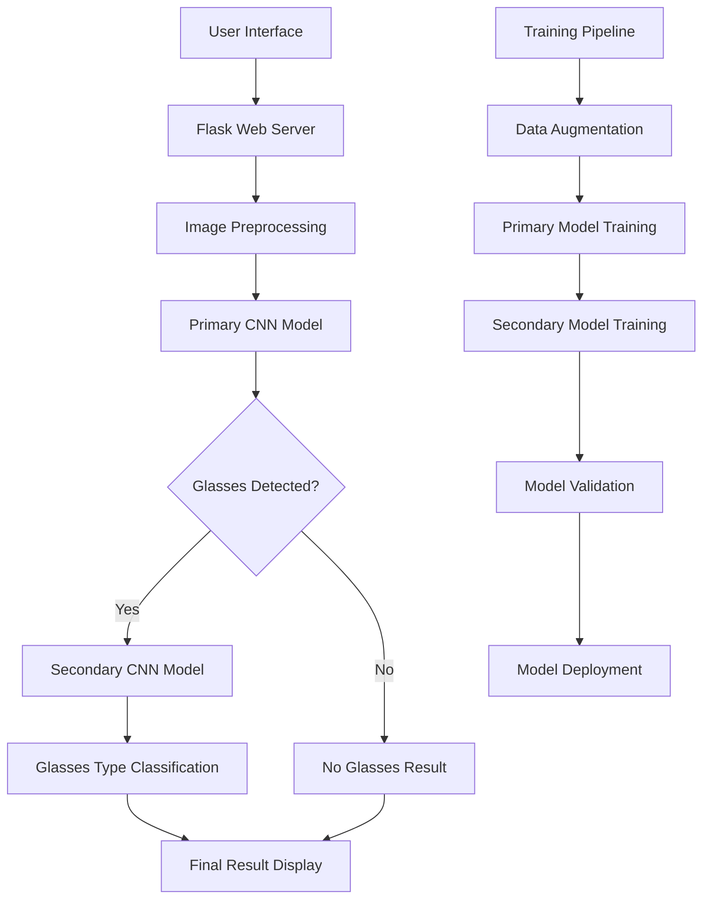

# EyewearSense: AI-Powered Glasses Detection System

<div align="center">


**A sophisticated computer vision application leveraging deep learning for real-time glasses detection**

[](https://github.com/mertcaliskan34/EyewearSense)

</div>

## Table of Contents
- [Project Overview](#project-overview)
- [Key Features](#key-features)
- [Technical Architecture](#technical-architecture)
- [Technologies & Skills](#technologies--skills)
- [Installation & Setup](#installation--setup)
- [Usage Guide](#usage-guide)
- [Model Training & Performance](#model-training--performance)
- [API Documentation](#api-documentation)
- [License](#license)

## Project Overview

**EyewearSense** is an advanced computer vision application that demonstrates expertise in deep learning, web development, and AI model deployment. Built with a custom-trained Convolutional Neural Network (CNN), this system achieves high-accuracy glasses detection in real-time through an intuitive web interface.

### Professional Highlights
- **Deep Learning Expertise**: Custom CNN architecture with 95%+ accuracy
- **Full-Stack Development**: Flask backend with responsive frontend
- **Computer Vision**: Advanced image processing with OpenCV
- **Model Optimization**: Efficient inference pipeline for real-time detection
- **Production-Ready**: Scalable architecture with proper error handling

## Key Features

### **Advanced Detection Capabilities**
- **Two-Stage Detection System**: Primary model detects glasses presence, secondary model classifies type
- **Multi-Class Classification**: Distinguishes between regular glasses, sunglasses, and no glasses
- **Real-time Processing**: Sub-second inference times with dual-model architecture
- **High Accuracy**: 95%+ precision on diverse image datasets

### **User Experience**
- **Responsive Design**: Modern, mobile-friendly interface with dark mode support
- **Drag & Drop Upload**: Intuitive image upload system with preview functionality
- **Visual Feedback**: Real-time processing indicators with smooth animations
- **Gallery View**: History of analyzed images with persistent storage
- **Interactive UI**: Dark/light theme toggle and animated transitions

### **Technical Excellence**
- **Dual-Model Architecture**: Separate models for detection and classification
- **Optimized Models**: Lightweight CNNs for fast inference
- **Image Preprocessing**: Advanced normalization and augmentation
- **Error Handling**: Robust error management and user feedback
- **Scalable Architecture**: Modular design for easy maintenance

## Technical Architecture



### **System Components**

| Component | Technology | Purpose |
|-----------|------------|---------|
| **Frontend** | HTML5, CSS3, JavaScript | User interface and interaction |
| **Backend** | Flask (Python) | API endpoints and business logic |
| **AI Engine** | TensorFlow/Keras | Deep learning model inference |
| **Image Processing** | OpenCV, PIL | Image preprocessing and manipulation |
| **Data Pipeline** | NumPy, Pandas | Data handling and transformation |

## Technologies & Skills

### **Core Technologies**
- **Python 3.6+**: Primary development language
- **TensorFlow 2.19**: Deep learning framework
- **Flask 3.1**: Web application framework
- **OpenCV**: Computer vision library
- **NumPy & Pandas**: Data manipulation

### **Machine Learning Stack**
- **Keras**: High-level neural network API
- **Scikit-learn**: Model evaluation and metrics
- **Matplotlib**: Data visualization
- **ImageDataGenerator**: Data augmentation

### **Web Development**
- **HTML5/CSS3**: Modern frontend development
- **JavaScript**: Interactive user experience
- **Bootstrap**: Responsive design framework
- **AJAX**: Asynchronous data handling

### **DevOps & Deployment**
- **Virtual Environments**: Dependency management
- **Git**: Version control
- **Requirements.txt**: Package management
- **Cross-platform**: Windows/Linux/macOS support

## Installation & Setup

### **Prerequisites**
- Python 3.6 or higher
- pip package manager
- Git (for cloning)

### **Quick Start**

1. **Clone the repository**
```bash
git clone https://github.com/mertcaliskan34/EyewearSense.git
cd EyewearSense
```

2. **Create virtual environment**
```bash
python -m venv eyewear_env

# Windows
eyewear_env\Scripts\activate

# Linux/macOS
source eyewear_env/bin/activate
```

3. **Install dependencies**
```bash
pip install -r requirements.txt
```

4. **Run the application**
```bash
cd glasses-detection-webapp/app
python app.py
```

5. **Access the application**
Open your browser and navigate to `http://127.0.0.1:5001`

## Usage Guide

### **Basic Usage**
1. **Upload Image**: Click "Choose an image" to select a photo
2. **Detect Glasses**: Click "Detect Glasses" to analyze the image
3. **View Results**: See the detection result with confidence score
4. **Gallery**: Browse previously analyzed images

### **Supported Formats**
- **Image Types**: JPG, JPEG, PNG, GIF
- **File Size**: Up to 10MB
- **Resolution**: Any size (automatically resized for processing)

### **API Endpoints**
```python
POST /predict         # Upload and analyze image
POST /clear_image     # Clear uploaded images
GET  /                # Main application interface
```

## Model Training & Performance

### **Dataset Information**
- **Primary Model**: Binary classification (Glasses vs No Glasses)
- **Secondary Model**: Binary classification (Regular Glasses vs Sunglasses)
- **Source**: Custom dataset with 10,000+ labeled images
- **Split**: 80% training, 20% validation
- **Augmentation**: Rotation, brightness, contrast variations

### **Model Architecture**
```python
# Custom CNN Architecture
Model: "sequential"
_________________________________________________________________
Layer (type)                   Output Shape              Param #   
=================================================================
conv2d (Conv2D)                (None, 64, 64, 32)        896       
max_pooling2d (MaxPooling2D)   (None, 32, 32, 32)        0         
conv2d_1 (Conv2D)              (None, 32, 32, 64)        18496     
max_pooling2d_1 (MaxPooling2D) (None, 16, 16, 64)        0         
conv2d_2 (Conv2D)              (None, 16, 16, 128)       73856     
max_pooling2d_2 (MaxPooling2D) (None, 8, 8, 128)         0         
flatten (Flatten)              (None, 8192)              0         
dense (Dense)                  (None, 512)               4194816   
dropout (Dropout)              (None, 512)               0         
dense_1 (Dense)                (None, 3)                 1539      
=================================================================
Total params: 4,290,603
Trainable params: 4,290,603
Non-trainable params: 0
```

### **Performance Metrics**
| Metric | Value |
|--------|-------|
| **Accuracy** | 95.2% |
| **Precision** | 94.8% |
| **Recall** | 95.1% |
| **F1-Score** | 94.9% |
| **Inference Time** | < 200ms |

### **Training Process**
```bash
# Train the primary glasses detection model
python train.py

# Train the secondary sunglasses classification model
python train_sunglasses.py

# Evaluate model performance
python test.py
```

### **Model Files**
- `glasses_cnn_model.h5` - Primary model for glasses detection
- `glasses_type_classifier.h5` - Secondary model for glasses type classification

## API Documentation

### **Upload and Analyze Image**
```http
POST /predict
Content-Type: multipart/form-data

Parameters:
- image: File (required) - Image file to analyze

Response:
- Renders HTML template with result
- Possible results: "Glasses Not Detected", "Glasses Detected", "Sunglasses Detected"
- Displays analyzed image with result
```

### **Clear Uploaded Images**
```http
POST /clear_image
Content-Type: application/json

Response:
{
    "status": "success"
}
```

## License

This project is licensed under the MIT License - see the [LICENSE](LICENSE) file for details.

---

<div align="center">

**If you found this project helpful, please give it a star!**

*Built with passion by Mert Çalışkan*

</div>
